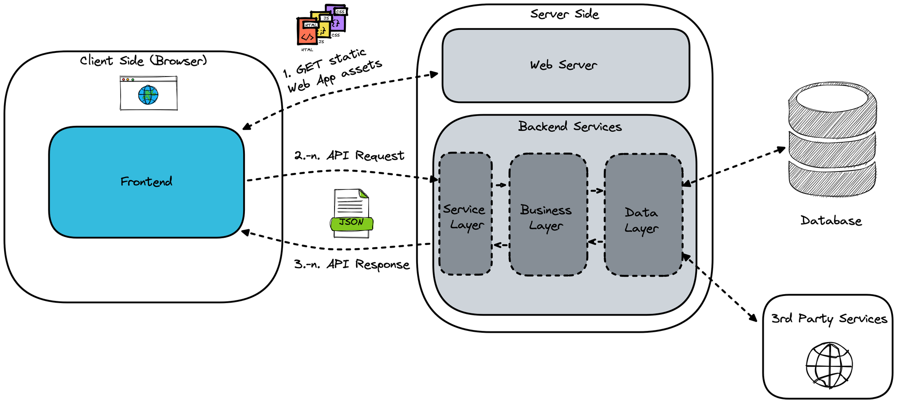

[comment]: # "This is the standard layout for the project, but you can clean this and use your own template"

# Engineering Education Unit

---

<!-- 
This is a sample image, to show how to add images to your page. To learn more options, please refer [this](https://projects.ce.pdn.ac.lk/docs/faq/how-to-add-an-image/)-->

 

## Table of Contents
1. [Introduction](#introduction)
2. [Problem Domain](#problem-domain)
3. [Functions of application](#functions-of-application)
4. [Team](#team)
5. [Links](#links)

---

## Introduction

 EEU is a comprehensive web application, offers a dynamic platform to facilitate learning, connect educators and students, and provide resources on a global scale. It coordinates activities in the areas of staff development, curriculum development, provision of audio - visual facilities for educational purposes and freshman orientation.

## Problem Domain
**User Friendly One**

- Have to improve the UI which is better than the previous one
- Home page of the previous page is given below

**Booking system**

- Create an efficient booking system with First Come First Serve method for the seminar rooms and the lecture halls

**Admin**

- If the changes needed in the website,Admin have to hard code to make the changes. But now the admin can change it easily without modifying the code.

**Security**

- Designed to improve the security of the website since previous one got hacked

## Solution Architecture

### INCRESE THE SECURITY
- Secure hosting provider,
- Strong authentication system
- Validation of  all user inputs 
- Regular backups 

### USER FRIENDLY UI
- Simple, accessible and responsive design to prioritize the most important information
- making them easy to find
- regularly solicit feedback from users.

### EFFICIENT BOOKING SYSTEM
- First come first serve
- User friendly one
- Make the process an easier one

## Functions of application

### User ( Lecturers / Students)
- Can book a seminar room or a lecture hall as wanted
- Designed to get the ideas about the general courses offered to the undergraduates in various times
- check the details of the past and the present staff of EEU.
- Designed to get the details of the TEAL 2.0 seminar series and videos of the some subjects and some events.

### Admin
- Update the pages when there is a need 
- Can book a lecture hall or a seminar room if its necessary even if it is already booked 
- Can upload the videos of some subjects and the events held in the university

## Data Flow

## Team
-  E/19/060, Danujan, [email](mailto:e19060@eng.pdn.ac.lk)
-  E/19/100, Sahira, [email](mailto:e19100@eng.pdn.ac.lk)
-  E/19/131, Kasuni, [email](mailto:e19131@eng.pdn.ac.lk)
-  E/19/266, Nithusikan, [email](mailto:e19266@eng.pdn.ac.lk)

## Links

- [Project Repository](https://github.com/cepdnaclk/e19-co227-Engineering-Education-Unit)
- [Project Page](https://cepdnaclk.github.io/e19-co227-Engineering-Education-Unit/)
- [Department of Computer Engineering](http://www.ce.pdn.ac.lk/)
- [University of Peradeniya](https://eng.pdn.ac.lk/)

[//]: # (Please refer this to learn more about Markdown syntax)
[//]: # (https://github.com/adam-p/markdown-here/wiki/Markdown-Cheatsheet)
